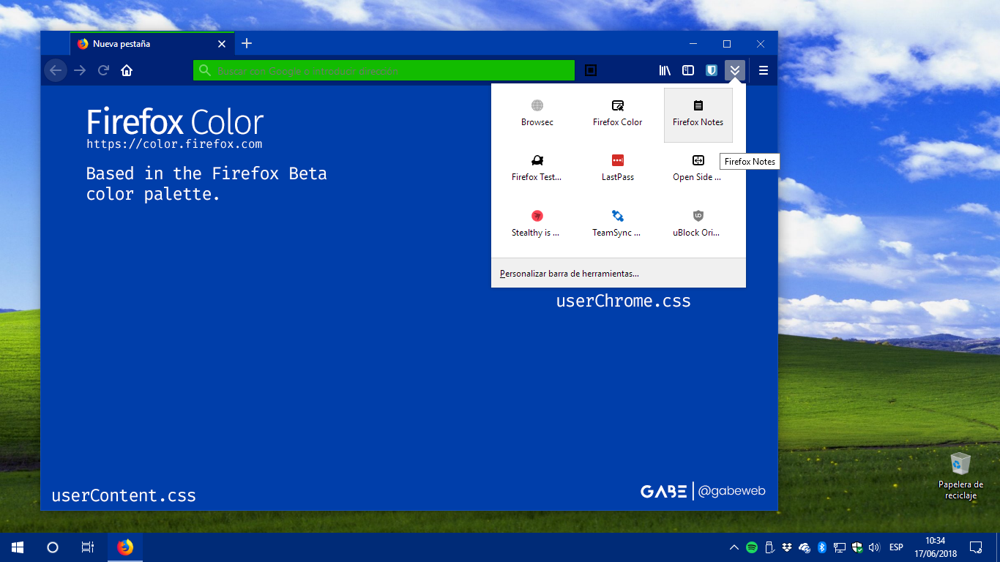

# Firefox Quantum UI Lite

Hello there. This is my first fork, here on GitHub.

This is an edition of the userChrome.css file ([FirefoxUI](https://github.com/axydavid/FirefoxUI) by [axydavid](https://github.com/axydavid)) to change the appearance of the Firefox Overflow Menu (where the icons of the complements are lodged) by a more practical and "elegant" drawer.

It's not a big deal, I just deleted some things and modified others, keeping the essence of Firefox Quantum.

It works for the Regular, Beta, Nightly and Developer editions. I've tried, for now, in Windows 7, Windows 10 and elementary OS Loki. Even in Firefox ESR virtualized in Windows XP.

It also looks good with the dark theme of Firefox.

Firefox on elementary OS Loki.

# How-To?

- Copy the [userChrome.css file](https://github.com/gabeweb/Firefox-Quantum-UI-Lite/raw/master/userChrome.css) (right-click -> Save Link As...) to your Firefox profile chrome folder.

- Restart Firefox.

# Want More?

I have made some colorful themes for Firefox using Firefox Color (from the Test Pilot), along with the respective userContent.css file, based on the official [branding color palette of Firefox](https://design.firefox.com/photon/visuals/color.html).

Firefox Regular ([Firefox Color](https://color.firefox.com/?theme=XQAAAALtAAAAAAAAAABBqYhm849SCiazH1KEGccwS-xNVAVDHz95P7etb3IyCJPFGgyLKEjfiFvJ24e59sGp_D1Gyp0LySJ9DVMcE6FmyFJVcRCYJT_WyPIED_yLwiwS3F3rTnAxWmyZmGQKS8GY9TGlwjrJPgCWF62GcrHMRzTKx3sLteF4Bf57-OiC_ydTaTDhNPulrJYjqnIEVNRhfuGPkfkFxCZ_uACuRZ14Gs_2k2z__9pGcAA)) / ([userContent.css](https://github.com/gabeweb/Firefox-Quantum-UI-Lite/raw/master/userContent(Regular%20and%20Beta).css); just save it as userContent.css in the chrome folder)

Firefox Beta ([Firefox Color](https://color.firefox.com/?theme=XQAAAALtAAAAAAAAAABBqYhm849SCiazH1KEGccwS-xNVAVDHz95P7etb3IyCJPFGgyLKEjfiFvJ24e59sGp_D1Gyp0LySJ9DVMcE6FmyFJVcRCYJT_WyPIED_yLwiwS3F3rTnBPD9_MeVa9iRRRabvXbRNWyQ7tkgAUI--Fq67yaOJKBvIDcQUq5y2eXUEIITRHxHexb5hB26Qe_v0cGaAicJkSLWxMlSb3kbfSxGI8oU4LMh_9m_6A)) / ([userContent.css](https://github.com/gabeweb/Firefox-Quantum-UI-Lite/raw/master/userContent(Regular%20and%20Beta).css); just save it as userContent.css in the chrome folder)

Firefox Developer Edition ([Firefox Color](https://color.firefox.com/?theme=XQAAAALuAAAAAAAAAABBqYhm849SCiazH1KEGccwS-xNVAVDHz96wepOunGQvWSsH6pW7E6dKGZtg8nP5BGm37yKX3qy-aHPfKrLklX_wHun7Htft0oU1agrRj1kUyvzqpbef9xPon56eYCkUx7DFB1akahizIvmBAX1Km8DBLaf97w5cJIRr3eedhTCorC2BTerMlq7jegu6k1wEoE5U7n_KyrHH1B8E8RuGFfryNSgF8H7_gu7AA)) / ([userContent.css](https://github.com/gabeweb/Firefox-Quantum-UI-Lite/raw/master/userContent(Developer).css); just save it as userContent.css in the chrome folder)

Firefox Nightly ([Firefox Color](https://color.firefox.com/?theme=XQAAAALvAAAAAAAAAABBqYhm849SCiazH1KEGccwS-xNVAVFskQ11ij6-VwpOlYg7qW9ztlIqKfxO4bVmKs1BH76h99lrt98GvSKOaC7LQ3j_8SOeD4825ApPOEVXm-7n7lUONboF-55gny3Z2jQC2Bk2lZ4V0lsEluizi7_TffGBnRPUtWeuq-4r9JpgetvUfh8OKHSfgEoBZjsRy5LYj8mw6JZhjvUNvQDc4ZmlT0QB43av_-W7KAA)) / ([userContent.css](https://github.com/gabeweb/Firefox-Quantum-UI-Lite/raw/master/userContent(Nightly).css); just save it as userContent.css in the chrome folder)

Suggestions and ideas are welcome!
